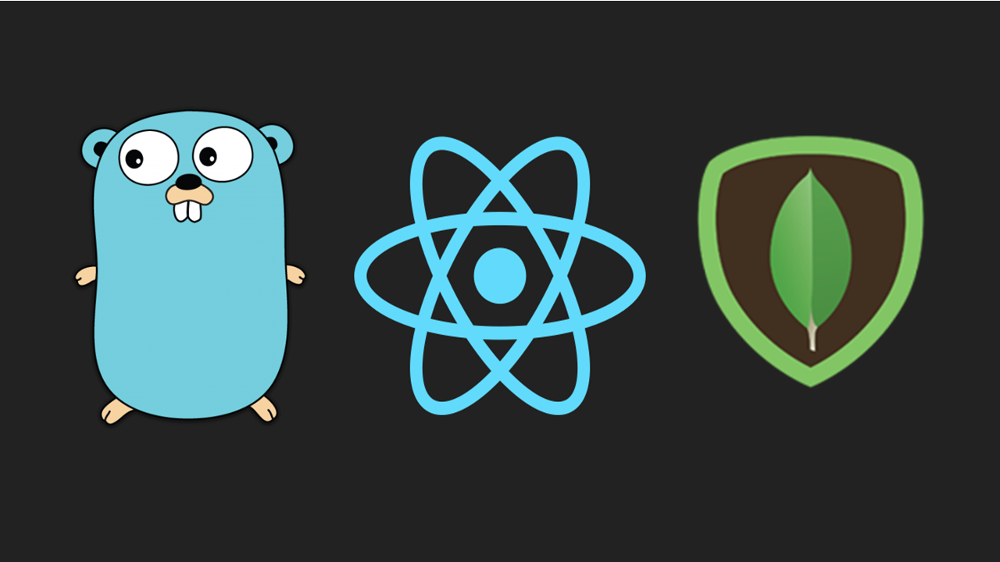

# Introduction


## Introduction
This is a simple todo app based on a tutorial by Shubham Chadokar. The server will be in Golang, the database will be MongoDB, and the frontend will be in React.

1. Server — Go
2. Database — MongoDB
3. Frontend — React

## Tutorial
Follow the [tutorial](https://levelup.gitconnected.com/build-a-todo-app-in-golang-mongodb-and-react-e1357b4690a6) here.

## Configure

### mongoDB environment variables
Copy the ./server/.env.example to ./server/.env and modifty the variables to match your mongoDB settings.

## Run

### server
cd server
go run main.go

```
Connected to MongoDB!
Collection instance created!
Starting server on the port 8080...
```

### client
npm start

```
Compiled successfully!

You can now view client in the browser.

  Local:            http://localhost:3000

Note that the development build is not optimized.
To create a production build, use npm run build.

webpack compiled successfully
```